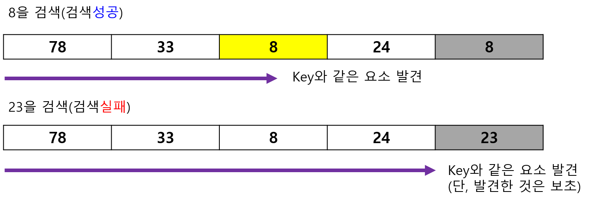
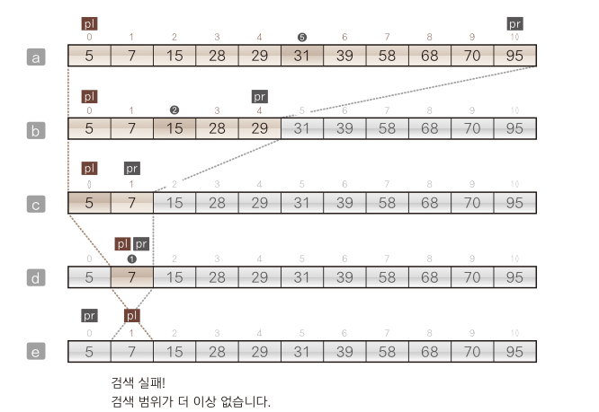
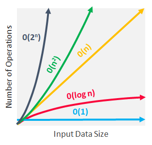

# 2주차 세미나 : 검색

<br />

## 1. **목차**

<br />

    1 [검색 알고리즘](#검색-알고리즘)
    2 [선형 검색](#선형-검색)
    3 [이진 검색](#이진-검색)

## 검색 알고리즘

검색(탐색) 알고리즘 : 데이터 집합에서 원하는 값을 가진 요소를 찾아내는 알고리즘

- 키(key) : 어떤 검색을 하더라도 **특정 항목에 주목** 한다는 점은 공통적이다. 이 때 주목하는 항목을 **키(key)** 라고 한다. 데이터가 단순한 정숫값이면 데이터 값 == 키 값이지만, 데이터의 '일부'를 키 값으로 지정하거나 논리곱, 논리합 등을 사용해 복합적으로 지정하기도 한다.

### 배열에서 검색하기

1. 배열 검색
   - 선형 검색 : 정렬되지 않은 데이터 모임에서 검색 수행
   - 이진 검색 : 정렬된 데이터 모임에서 빠른 검색 수행
   - 해시법 : 추가, 삭제가 자주 일어나는 데이터 모임에서 빠른 검색 수행 ( 체인법, 오픈 주소법)
2. 선형 리스트 검색
3. 이진검색트리 검색

<br />

**검색 알고리즘은 검색 속도만 빠르면 된다??**

: 상황에 따라 다르다. 예를 들어, 데이터 집합에 대해 검색 뿐만 아니라 데이터 추가를 자주 하는 경우(ex. 배열 밀어내기)에는 검색이 아무리 빠르더라도 데이터의 추가 비용이 많이 들어가는 알고리즘은 부담스럽다!

=> 따라서 여러가지 선택지가 있다면, 용도나 목적, 실행 속도, 자료구조 등을 포괄적으로 고려하여 알고리즘을 선택해야 한다.

---

## 선형 검색

배열에서 검색하는 방법 중 가장 기본적인 알고리즘.

### 선형 검색(linear search) / 순차 검색(squential search)

: 요소가 직선 모양으로 늘어선 배열에서 원하는 키 값을 갖는 요소를 만날 때까지 맨 앞부터 순서대로 검색하는 알고리즘

{: width="100" height="100"}

```java
import java.util.Scanner;

class SeqSearch {
  static int seqSearch(int[] a, int n, int key) {
    int i = 0;

    for (int i = 0; i < n; i++) {
      if (a[i] == key) return i; // 찾으면 i 반환
    }
    return -1; // 못찾으면, 즉 배열 내에 키값이 없으면 -1 반환
  }

  public static void main(String[] args) {
    Scanner stdIn = new Scanner(System.in);

    System.out.print("요솟수 : "); int num = stdIn.nextInt();
    int[] x = new int[num];

    for (int i = 0; i < num; i++) {
      System.out.print("x[" + i + "]: ");
      x[i] = stdIn.nextInt();
    }

    System.out.print("검색할 값: ");
    int ky = stdIn.nextInt();

    int idx = seqSearch(x, num, ky);

    if (idx == -1)
      System.out.println("찾는 값이 없음");
    else
      Sytem.out.println(ky + "은(는) x[" + idx + "]에 있습니다.");
  }
}
```

<br />

### 보초법

위의 코드에서 검색 함수의 for 문을 while 문으로 다시 써보면,

```java
while (true) {
  if (i == n)
    return -1;
  if (a[i] == key)
    return i;
  i++;
}
```

이 때 while문이 돌 때마다 종료 조건 검사가 불필요하게 두 번씩 일어나게 된다.

이때, 불필요한 종료 조건 검사를 하지 않기 위해서 **보초법(sentinel method)** 를 활용한다.

보초법이란 ? 찾고자 하는 키 값을 검색 대상 배열 마지막에 추가해주어 키 값이 배열에 있든, 없든 배열만 순회하면 검색 결과가 나오게 하는 방법

{: width="100" height="100"}

코드로 확인하자.

```java
static int seqSearchSen(int[] a, int n, int key) {
  int i = 0;

  a[n] = key; // 보초를 추가, 보초를 추가해주기 위해 배열의 크기는 배열의 원래 요솟값 + 1로 지정해주어야 한다.

  while (true) {
    if (a[i] == key)
      break;
    i++;
  }
  return i == n ? -1 : i;
}
```

그런데 그냥 for문 쓰면 안되나,,,??

<br />

---

## 이진 검색

### 이진 검색(binary search)

: 요소가 오름차순 또는 내림차순으로 정렬된 배열에서 검색하는 알고리즘으로 로직은 다음과 같다.

1. 배열의 중간 인덱스를 찾는다.
2. 중간 인덱스의 값과 키 값을 비교한다. 만약, 중간 인덱스의 값과 키 값이 다르다면 배열이 정렬되어 있음을 전제로 하기 때문에 키 값이 없을 것이 확실한 반(半)을 제외한다. 중간 인덱스와 키 값이 같다면 그대로 중간 인덱스를 반환한다.
3. 나머지 반을 새로운 배열로 생각하여 1, 2의 과정을 반복한다. (찾는 값이 없을 경우도 고려해야 한다.)

<br />

{: width="100" height="100"}

우리가 찾는 값(키 값)을 6이라고 가정하자. 정렬된 배열 A의 중간 인덱스의 값(31)과 키 값을 비교했을 때 키 값이 더 작다는 것을 알 수 있다.

**배열이 오름차순으로 정렬 되어 있으므로 당연히 중간 인덱스 오른편(즉, 31보다 큰 숫자들)에는 우리가 찾는 키 값이 있을 수가 없다.**

따라서 키 값이 있을 가능성이 있는 A[0]부터 A[4]를 새로운 배열로 보고 다시 중간값을 찾아서 비교하는 과정을 반복한다.

위 과정을 반복하다 중간값이 키 값과 같다면 그 인덱스를 반환하고, 없다면 검색이 실패했다는 신호를 주기 위해 -1 등을 반환한다.

```java
import java.util.Scanner;

class BinSearch {
  // 요솟수가 n인 배열 a에서 key와 같은 요소를 이진 검색
  static int binSearch(int[] a, int n, int key) {
    int start = 0; // 검색 범위의 첫 인덱스
    int end = n - 1; // 검색 범위의 마지막 인덱스

    do {
      int mid = (start + end) / 2; // 중앙 요소의 인덱스
      if (a[mid] == key)
        return mid; // 키 값을 찾았을 경우 중앙 요소의 인덱스 반환
      else if (a[mid] < key)
        start = mid + 1; // 중앙 요소가 키 값보다 작은 경우 검색 범위를 뒤쪽 절반으로 좁힘
      else
        end = mid - 1; // 중앙 요소가 키 값보다 큰 경우 검색 범위를 앞쪽 절반으로 좁힘
    } while (start <= end);

    return -1; // 검색 실패한 경우
  }

  public static void main(String[] args) {
    Scanner stdIn = new Scanner(System.in);

    System.out.print("요솟수 : ");
    int num = stdIn.nextInt();
    int[] x = new int[num]; // 요솟수가 num인 배열

    System.out.println("오름차순으로 입력하세요.");

    System.out.print("x[0]: ");
    x[0] = stdIn.nextInt();

    for (int i = 1; i < num; i++) {
      do {
        System.out.print("x[" + i + "]: ");
        x[i] = stdIn.nextInt();
      } while (x[i] < x[i - 1]);
    }

    System.out.print("검색할 값: ");
    int ky = stdIn.nextInt();

    int idx = binSearch(x, num, ky);

    if (idx == -1)
      System.out.println("그 값의 요소가 없습니다.");
    else
      System.out.println(ky + "은(는) x[" + idx + "]에 있습니다.");
  }
}
```

### 복잡도(complexity)
: 알고리즘의 성능을 자원(시간, 공간=메모리) 측면에서 객관적으로 평가하는 기준

1. 시간 복잡도(time complexity) : 실행에 필요한 시간을 평가한 것, 주로 *기본 연산의 횟수* 로 측정되며 *Big-O notation* 을 활용하여 표기한다.

  > 기본연산자 : +, -, *, /, = 등 가장 기본이 되는 하나의 연산자 (대입, 산술, 논리, 비교 등등..)

예를 들어서, 
```java
public static int add(int a, int b) {
  int result = a + b;
  return result;
}
```
`a + b`에서 한 번, 그리고 그 값을 `result`에 할당할 떄 한 번, 총 두 번의 기본 연산이 이루어지므로 `add()` 함수의 시간 복잡도는 2라고 할 수 있다.

그렇다면, 다음 for 문에서는 기본 연산이 총 몇 번 일어날까? 
```java
int current;
for (int i = 0; i < n; i++) {
  current = i;
}
```
처음 `i`를 초기화 해줄 때 1번, for 문이 돌 때마다 `i <ㅠ n` 를 확인하므로 n번, 마찬가지로 for 문을 돌 때마다 `i++` 해주므로 n번, 그리고 for문의 몸체에서 `current`에 `i`를 할당할 때 n번으로 총 3n + 1번의 기본 연산이 일어난다. (맞나?)
<br />

   > *Big-O notation* 이란? 함수가 조금만 복잡해져도 위와 같이 기본 연산을 계산하여 시간 복잡도를 구하는 것은 너무 번거롭고 어려운 일이 될 것이다. <br /> 따라서 빅오 표기법에서는 **데이터 n이 충분히 크다는 가정 하에** 인풋 데이터 n에 따른 시간 복잡도의 증가율을 간소화 하여 표기한다. 그 방법은 다음과 같다. <br /><br /> 1. 인풋의 갯수 n이 매우 크다면, 전체 연산의 횟수에서 상수는 큰 영향을 주지 못하므로 고려하지 않는다. <br /> 2. 위와 비슷한 논리에서, *n^2 + n* 일 때, n 제곱에 비해서 n은 사소한 숫자 이므로 가장 높은 복잡도인 n^2만 사용한다. <br /><br /> 위의 내용에 대한 예시를 들어보면, 어떤 알고리즘의 시간 복잡도가 T(n) = 2n^3 + 6n + 10000000 일 때 이것을 빅오 표기법으로는 O(n^3)으로 표기한다.
   


<br />

**1. 선형 검색의 시간 복잡도**

따라서 앞서 나온 선형 검색 함수
```java
  static int seqSearch(int[] a, int n, int key) {
    int i = 0;

    for (int i = 0; i < n; i++) {
      if (a[i] == key) return i; // 찾으면 i 반환
    }
    return -1; // 못찾으면, 즉 배열 내에 키값이 없으면 -1 반환
  }
```
의 시간 복잡도를 계산해보자. 

이 알고리즘의 경우 가장 운이 좋은 경우(*best case*)라면, 찾는 키 값이 0에 있는 경우, 즉 1의 시간 복잡도를 가진다. 하지만 운이 좋지 않아(*worst case*) 모든 요소를 다 순회한 후에 결과 값이 나온다면 시간 복잡도는 n이 될 것이다. 따라서 평균적인 시간 복잡도를 n/2라고 하면 이를 빅오 표기법으로는 O(n)이라고 표기한다.

또 다른 예시로, 어떤 알고리즘이 두 개의 복잡도를 가지고 있을 때는 다음과 같이 시간 복잡도를 계산한다.
`O(f(n)) + O(g(n)) = O(max(f(n), g(n)));

**2. 이진 검색의 시간 복잡도**

이진 검색은 한번 루프가 돌 때마다 고려해야 할 데이터의 양이 반으로 줄어든다(중간 값을 기준으로 왼쪽, 오른쪽만 고려하기 때문에). 따라서 이진 검색의 시간 복잡도 O(n)은 *logn*이라고 할 수 있다. 

** 참고 자료 : 시간 복잡도의 증가율 대소 관계

{: width="100" height="100" }

### Arrays.binarySearch
: 자바에서는 배열에서 이진 검색하는 메서드를 표준 라이브러리로 제공한다.
그것이 바로 `java util.Arrays` 클래스의 `binarySearch` 메소드인데 이 메소드는 다음과 같은 장점을 가진다.
  1. 이진 검색 메소드를 직접 코딩할 필요가 없다.
  2. 모든 자료형 배열에서 검색할 수 있다.(오버로딩 되어 있음) <br /> `static int binarySearch(Type[] a, Type key)`

검색에 성공한다면 key와 일치하는 요소의 인덱스를 반환한다. 이 때 일치하는 요소가 여러 개 있다면 **무작위의 인덱스**를 반환한다. 

만약, 검색에 실패 했다면 삽입 포인트를 x라고 할 때 -x-1을 반환한다
> 삽입 포인트 : 검색하기 위해 지정한 key보다 큰 요소 중 첫번째 요소의 인덱스, 만약 배열의 모든 요소가 key보다 작다면 배열의 길이가 삽입 포인트가 된다. ex) `binarySearch(new int[]{1, 2, 3, 4, 5}, 3)`이면 삽입 포인트의 인덱스는 3(값은 4)이고, 검색에 실패한 경우 반환 값은 -4

<br />

### 보충수업: 클래스 메서드와 인스턴스 메서드

<br />

클래스 vs 객체 vs 인스턴스

 : 클래스는 하나의 '설계도'다. 흔히 클래스를 '붕어빵 틀'이라고 비유한다. 그렇다면 객체는 무엇일까? 객체는 클래스를 통해 만들어 내는 것이다. 붕어빵 틀을 이용해 만들 수 있는건 무엇일까? 바로 '붕어빵'이다. 그리고 인스턴스란 객체가 실제 구현된 것으로서 우리의 비유에서는 '만들어진 붕어빵 하나하나'를 의미한다. 혹은 어떤 객체를 그 객체의 클래스와의 관계 측면에서 바라볼 때 인스턴스라고 하기도 한다. 더 자세한 설명은 [여기](https://gist.github.com/ninanung)

 같은 맥락에서,

1. 인스턴스 메소드는 static을 붙이지 않고 선언한 메소드로서 각각의 개체가 구현 되어야 사용할 수 있는 메소드다. 붕어빵이라는 부류 자체의 기능이나 속성이 아니라 각각의 붕어빵이 개별적으로 가지고 있는 특성이다.
2. 클래스 메소드는 static을 붙여 선언했기 때문에 각각의 개체를 직접 구현하지 않고서도 사용할 수 있는 메소드다. 각각의 붕어빵이 가진 특성보다는 붕어빵이라는 음식이 공유하고 있는 특성이다. 
3. 인스턴스 필드 / 클래스 필드 또한 같은 맥락에서 비교가 가능하다.

<br />

코드로 확인
```java
class Id {
  private static int counter = 0; // 아이디를 몇 개 부여했는지 저장
  private int id;                 // 아이디

  // 생성자
  public Id() { id = ++counter };

  // 아이디를 반환하는 인스턴스 메소드
  puvlic int getId() { return id; }

  // counter를 반환하는 클래스 메소드
  public static int getCounter() { return counter; }
}

public class IdTester {
  public static void main(String[] args) {
    Id a = new Id();
    Id b = new Id();

    System.out.println("a의 아이디: " + a.getId());
    System.out.println("b의 아이디: " + b.getId());

    System.out.println("부여한 아이디의 개수: " + Id.getCounter());
  }
}
```

**객체의 배열에서 검색하기**

이진 검색은 정렬되어 있음을 전제로 한다고 했는데, 그렇다면 정렬되기 힘들 것 같은 객체의 배열에도 `binarySearch()` 메소드를 사용할 수 있을까?

1. `static int binarySearch(Object[] a, Object key)`
   
   : 자연 정렬이라는 방법으로 요소의 대소 관계 판단. 따라서 정수나 문자열 배열에서 검색할 때 적당.

1. `static <T> int binarySearch(T[] a, T key, Comparator<? super T>c)`

   : *자연 순서*가 아닌 순서로 줄지어 있는 배열에서 검색하거나 *자연 순서*를 논리적으로 갖지 않는 클래스 배열에서 검색할 때 알맞다. 이 경우 제네릭 메소드(generic method)를 활용한다.


