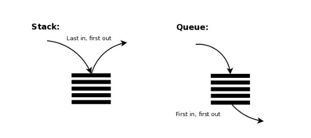

# 4-2. 큐(Queue)

## 1. 큐란?

- 스택과 마찬가지로 데이터를 일시적으로 쌓아 두기 위한 자료구조
- **FIFO(First In First Out, 선입선출)**



Fig 1. 스택과 큐 ([https://gohighbrow.com/stacks-and-queues/](https://gohighbrow.com/stacks-and-queues/))

- **enqueue(인큐)** : 데이터를 넣는 작업
- **dequeue(디큐)** : 데이터를 꺼내는 작업
- **front** or **head** : 데이터를 꺼내는 쪽
- **rear** or **back** or **tail** :  데이터를 넣는 쪽


Fig 2. enqueue와 dequeue, front와 back


## 2. 배열로 큐 만들기


Fig 3. Array-Based Queue

### 시간 복잡도?

- 큐의 **rear element**가 **position 0**에 있을 때
- dequeue operation?

    **Θ(1) time** : front element가 배열의 last element

- enqueue operation?

    **Θ(n) time :** n개의 element가 한자리씩 이동

- 큐의 **rear element**가 **position n-1**에 있을 때
- dequeue operation?

    **Θ(n) time** : n-1개의 element가 한자리씩 이동

- enqueue operation?

    **Θ(1) time :** 배열의 마지막 요소로 추가

## 3. 링 버퍼로 큐 만들기

### 링 버퍼란?

- 배열의 처음이 끝과 연결되었다고 보는 자료구조를 말한다
- 여기서 front와 rear는 배열의 **물리적 요소의 순서가 아닌 논리적인 데이터 순서**를 말한다

### 장점?

- 배열에서 발생했던 요소 이동 문제를 해결 가능
- **Θ(n) time** → **Θ(1) time**

### 문제?

- front와 rear의 값이 같을 때 **큐가 비어 있는지, 가득 차 있는지 알 수 없다**
    - **해결 1.** 현재 데이터 수(num) 이용

    ```java
    public class NumQueue {
        private int max;        // 큐 용량
        private int front;      // 첫 번째 요소 커서
        private int rear;       // 마지막 요소 커서
        private int num;        // 현재 데이터 수
        private int[] que;      // 큐 본체

        public NumQueue(int capacity) {
            num = front = rear = 0;
            max = capacity;
            try {
                que = new int[max];              // 큐 본체용 배열을 생성
            } catch (OutOfMemoryError e) {
                max = 0;
            }
        }
    }
    ```

    - **해결 2.** max = capacity + 1로 설정 (비둘기집 원리)
    - 비둘기집 원리?

        비둘기집 원리는 n+1개의 물건을 n개의 상자에 넣을 때 적어도 어느 한 상자에는 두 개 이상의 물건이 들어 있다는 원리를 말한다. 

    ```java
    public class SizeQueue {
        private int max;        // 큐 용량
        private int front;      // 첫 번째 요소 커서
        private int rear;       // 마지막 요소 커서
        private int[] que;      // 큐 본체

        public SizeQueue(int capacity) {
            front = rear = 0;
            max = capacity + 1;
            try {
                que = new int[max];              // 큐 본체용 배열을 생성
            } catch (OutOfMemoryError e) {
                max = 0;
            }
        }
    }
    ```


### 큐 클래스

큐를 관리하는 클래스로, 아래와 같이 5(4)개의 필드로 구성된다

1. **큐로 사용할 배열(que)**

    인큐하는 데이터를 저장하기 위한 큐 본체용 배열

    > 필드 que는 실제로는 배열 본체가 아니라 본체를 참조하는 배열 변수이다. 배열 본체는 생성자로 생성한다.

2. **큐의 최대용량(max)**

    큐의 최대 용량을 저장하는 필드로, 이 값은 배열 que에 저장할 수 있는 최대 요소의 개수와 같다

3. **front**

    인큐하는 데이터 가운데 첫 번째 요소의 인덱스를 저장하는 필드

4. **rear**

    인큐한 데이터 가운데 맨 나중에 넣은 요소의 하나 뒤의 인덱스를 저장하는 필드

5. **현재 데이터수 (num)**

    큐에 쌓아 놓은 데이터 수를 나타내는 필드

### 생성자

- 생성시 큐는 비어 있기 때문에 num, front, rear의 값을 모두 0으로 설정
- 매개변수 capacity로 전달받은 큐의 용량을 필드 max에 복사
- 요솟수가 max인 배열 que의 본체를 생성

### 인큐 메서드 enque

### 디큐 메서드 deque

선호? 효율?

```java
// 큐에 데이터를 인큐
    public int enque(int x) throws OverflowIntQueueException {
        if (num >= max)
            throw new OverflowIntQueueException();			// 큐가 가득 참
        que[rear++] = x;
        num++;
        if (rear == max)
            rear = 0;
        /* que[rear] = x;
        rear = (rear + 1) % max; */
        return x;
    }

    // 큐에서 데이터를 디큐
    public int deque() throws EmptyIntQueueException {
        if (num <= 0)
            throw new EmptyIntQueueException();				// 큐가 비어 있음
        int x = que[front++];
        num--;
        if (front == max)
            front = 0;
        /* int x = que[front];
        front = (front + 1) % max; */
        return x;
    }
```

```java
// 큐에 데이터를 인큐
    public int enque(int x) throws OverflowIntQueueException {
        if (num >= max)
            throw new OverflowIntQueueException();			// 큐가 가득 참
        /* que[rear++] = x;
        num++;
        if (rear == max)
            rear = 0; */
        que[rear] = x;
        rear = (rear + 1) % max;
        return x;
    }

    // 큐에서 데이터를 디큐
    public int deque() throws EmptyIntQueueException {
        if (num <= 0)
            throw new EmptyIntQueueException();				// 큐가 비어 있음
        /* int x = que[front++];
        num--;
        if (front == max)
            front = 0; */
        int x = que[front];
        front = (front + 1) % max;
        return x;
    }
```

---

### 링 버퍼의 활용

링 버퍼는 '오래된 데이터를 버리는' 용도로 사용 가능하다. 예를 들어 요소의 개수가  n인 배열에 계속해서 데이터가 입력될 때 가장 최근에 들어온 n개만 저장하고 오래된 데이터는 버리는 용도로 사용한다.

```java
package chap04;
import java.util.Scanner;
// 원하는 개수만큼 값을 입력 받아 요솟수 N인 배열에 마지막 N개를 저장

class LastNElements {
	public static void main(String[] args) {
		Scanner stdIn = new Scanner(System.in);
		final int N = 10;
		int[] a = new int[N];		// 입력 받은 값을 저장
		int cnt = 0;				// 입력 받은 개수
		int retry;					// 다시 한 번?

		System.out.println("정수를 입력하세요.");

		do {
			System.out.printf("%d번째 정수：", cnt + 1);
			a[cnt++ % N] = stdIn.nextInt();                  // 값을 덮어 씌운다.

			System.out.print("계속 할까요? (예.1／아니오.0）：");
			retry = stdIn.nextInt();
		} while (retry == 1);

		int i = cnt - N;
		if (i < 0) i = 0;

		for ( ; i < cnt; i++)
			System.out.printf("%2d번째의 정수 ＝ %d\n", i + 1, a[i % N]);
	}
}
```

```java
a[cnt++ % N] = stdIn.nextInt();                  // 값을 덮어 씌운다.
```


## 자바에서 큐를 사용해보자

```jsx
import java.util.Collection;
import java.util.Iterator;
import java.util.Queue;

public class Test {
    public static void main(String[] args) {
        Queue<String> que = new Queue<String>() {
            @Override
            public boolean add(String s) {
                return false;
            }

            @Override
            public boolean offer(String s) {
                return false;
            }

            @Override
            public String remove() {
                return null;
            }

            @Override
            public String poll() {
                return null;
            }

            @Override
            public String element() {
                return null;
            }

            @Override
            public String peek() {
                return null;
            }

            @Override
            public int size() {
                return 0;
            }

            @Override
            public boolean isEmpty() {
                return false;
            }

            @Override
            public boolean contains(Object o) {
                return false;
            }

            @Override
            public Iterator<String> iterator() {
                return null;
            }

            @Override
            public Object[] toArray() {
                return new Object[0];
            }

            @Override
            public <T> T[] toArray(T[] a) {
                return null;
            }

            @Override
            public boolean remove(Object o) {
                return false;
            }

            @Override
            public boolean containsAll(Collection<?> c) {
                return false;
            }

            @Override
            public boolean addAll(Collection<? extends String> c) {
                return false;
            }

            @Override
            public boolean removeAll(Collection<?> c) {
                return false;
            }

            @Override
            public boolean retainAll(Collection<?> c) {
                return false;
            }

            @Override
            public void clear() {
            }
        }
    }
}
```


Fig 4. Queue Interface In Java([https://www.geeksforgeeks.org/queue-interface-java/](https://www.geeksforgeeks.org/queue-interface-java/))

Queue 인터페이스는 java.util 패키지에 존재하고, Collection 인터페이스를 상속받는다. 

인터페이스가 되기 위해서 큐는 선언을 위한 구체적인 클래스가 필요하고, 자바에서 가장 일반적으로 사용되는 클래스는 **PriorityQueue와 LinkedList**이다. 두 구현 방법 모두 thread safe 하지 않은 방법이고, thread safe 구현이 요구되는 상황에서 **PriorityBlocking Queue**가 대안이 된다.

- thread safe?

    스레드 안전(thread 安全, 영어: thread safety)은 멀티 스레드 프로그래밍에서 일반적으로 어떤 함수나 변수, 혹은 객체가 여러 스레드로부터 동시에 접근이 이루어져도 프로그램의 실행에 문제가 없음을 뜻한다. 보다 엄밀하게는 하나의 함수가 한 스레드로부터 호출되어 실행 중일 때, 다른 스레드가 그 함수를 호출하여 동시에 함께 실행되더라도 각 스레드에서의 함수의 수행 결과가 올바로 나오는 것으로 정의한다.

## Creating Queue Objects

큐는 인터페이스이므로, 객체는 큐 타입으로 생성될 수 없다. 따라서 객체를 생성하기 위해서는 항상 큐를 상속받는 클래스가 필요하다.  또한, Java 1.5에서 Generics이 도입된 이후로, 큐 내부에 저장될 수 있는 객체의 타입을 제한하는 것이 가능해졌다.

```jsx
// Obj is the type of the object to be stored in Queue
Queue<Obj> queue = new PriorityQueue<Obj> ();
```

## Operations on Queue Interface

### Priority Queue class

1. **Adding Elements**

    Priority Queue 에서는 요소가 삽입되는 순서로 저장되지 않는다. 요소는 기본적으로 **오름차순인 우선순위를 기준으로 저장**된다.

    ```java
    import java.util.*; 
      
    public class GFG { 
      
        public static void main(String args[]) 
        { 
            Queue<String> pq = new PriorityQueue<>(); 
      
            pq.add("Geeks"); 
            pq.add("For"); 
            pq.add("Geeks"); 
      
            System.out.println(pq); 
        } 
    }
    ```

    - **출력결과**

        ```jsx
        [For, Geeks, Geeks]
        ```

2. **Removing Elements**

    큐에서 해당 요소를 삭제하기 위해서 remove() method를 사용할 수 있다. **해당 객체가 다수일 경우, 첫번째로 나타나는 객체를 제거**한다. poll() method는 head에 존재하는 요소를 제거하고, 반환해준다.

    ```java
    import java.util.*; 
      
    public class GFG { 
      
        public static void main(String args[]) 
        { 
            Queue<String> pq = new PriorityQueue<>(); 
      
            pq.add("Geeks"); 
            pq.add("For"); 
            pq.add("Geeks"); 
      
            System.out.println("Initial Queue " + pq); 
      
            pq.remove("Geeks"); 
      
            System.out.println("After Remove " + pq); 
      
            System.out.println("Poll Method " + pq.poll()); 
      
            System.out.println("Final Queue " + pq); 
        } 
    }
    ```

    - **출력결과**

        ```java
        Initial Queue [For, Geeks, Geeks]
        After Remove [For, Geeks]
        Poll Method For
        Final Queue [Geeks]
        ```

3. **Iterating the Queue**

    많은 방법이 존재하지만 가장 많이 사용되는 방법은 큐를 배열로 전환하고, for loop를 사용하는 방법이다. 하지만, 큐는 내장 iterator도 갖고 있다.

    ```java
    // Java program to iterate elements 
    // to a Queue 
      
    import java.util.*; 
      
    public class GFG { 
      
        public static void main(String args[]) 
        { 
            Queue<String> pq = new PriorityQueue<>(); 
      
            pq.add("Geeks"); 
            pq.add("For"); 
            pq.add("Geeks"); 
      
            Iterator iterator = pq.iterator(); 
      
            while (iterator.hasNext()) { 
                System.out.print(iterator.next() + " "); 
            } 
        } 
    }
    ```

    - **출력결과**

        ```java
        For Geeks Geeks
        ```

## Classes which implement the Queue Interface

### PriorityQueue

PriorityQueue class는 FIFO algorithm을 따르지만, 때때로 queue의 요소를 우선순위에 따라 동작시켜야할 때 유용하게 사용된다. 

```java
import java.util.*; 
  
class GfG { 
  
    public static void main(String args[]) 
    { 
        // Creating empty priority queue 
        Queue<Integer> pQueue 
            = new PriorityQueue<Integer>(); 
  
        // Adding items to the pQueue 
        // using add() 
        pQueue.add(10); 
        pQueue.add(20); 
        pQueue.add(15); 
  
        // Printing the top element of 
        // the PriorityQueue 
        System.out.println(pQueue.peek()); 
  
        // Printing the top element and removing it 
        // from the PriorityQueue container 
        System.out.println(pQueue.poll()); 
  
        // Printing the top element again 
        System.out.println(pQueue.peek()); 
    } 
}

// Output
10
10
15
```

### LinkedList

요소들이 포인터와 addresses를 통해 연결되어 있따. 각 요소들은 node로 불린다. 삽입과 제거가 동적이고, 쉽기 때문에 선호된다.

```java
import java.util.*; 
  
class GfG { 
  
    public static void main(String args[]) 
    { 
        // Creating empty LinkedList 
        Queue<Integer> ll 
            = new LinkedList<Integer>(); 
  
        // Adding items to the ll 
        // using add() 
        ll.add(10); 
        ll.add(20); 
        ll.add(15); 
  
        // Printing the top element of 
        // the LinkedList 
        System.out.println(ll.peek()); 
  
        // Printing the top element and removing it 
        // from the LinkedList container 
        System.out.println(ll.poll()); 
  
        // Printing the top element again 
        System.out.println(ll.peek()); 
    } 
}

//Output
10
10
20
```

### PriorityBlockingQueue

PriorityQueue와 LinkedList는 not thread-safe로 알려져 있다. 따라서 thread-safe한 구현이 필요할 경우 사용가능한 대안이 된다. PriorityQueue와 같은 정렬방식을 가지며, 입력무제한(unbounded)으로 기본 설계가 되었기 때문에 추가작업 수행중 fail이 나면 이것은 자원고갈이 났다는 뜻이다. (OutOfMemoryError 발생) 

```java
// Java program to demonstrate the 
// creation of queue object using the 
// PriorityBlockingQueue class 
  
import java.util.concurrent.PriorityBlockingQueue; 
import java.util.*; 
  
class GfG { 
    public static void main(String args[]) 
    { 
        // Creating empty priority 
        // blocking queue 
        Queue<Integer> pbq 
            = new PriorityBlockingQueue<Integer>(); 
  
        // Adding items to the pbq 
        // using add() 
        pbq.add(10); 
        pbq.add(20); 
        pbq.add(15); 
  
        // Printing the top element of 
        // the PriorityBlockingQueue 
        System.out.println(pbq.peek()); 
  
        // Printing the top element and 
        // removing it from the 
        // PriorityBlockingQueue 
        System.out.println(pbq.poll()); 
  
        // Printing the top element again 
        System.out.println(pbq.peek()); 
    } 
}
```

## 어디서 사용할까?

- 어떠한 작업/데이터를 순서대로 실행/사용하기 위해 대기시킬 때 사용
- 서로 다른 쓰레드 사이 또는 프로세스 사이에서나 네트워크를 통해 자료를 주고받을 때 자료를 일시적으로 저장하는 용도로 많이 사용
- 우선순위가 같은 작업 예약 (프린터의 인쇄 대기열)
- 은행 업무
- 콜센터 고객 대기시간
- 프로세스 관리
- 너비 우선 탐색(BFS, Breadth-First Search) 구현
- 캐시(Cache) 구현

**References**

[https://devuna.tistory.com/22](https://devuna.tistory.com/22)

[https://do-study.tistory.com/39](https://do-study.tistory.com/39)

[https://gompangs.tistory.com/entry/OS-Thread-Safe란](https://gompangs.tistory.com/entry/OS-Thread-Safe%EB%9E%80)

[**https://www.geeksforgeeks.org/queue-interface-java/**](https://www.geeksforgeeks.org/queue-interface-java/)