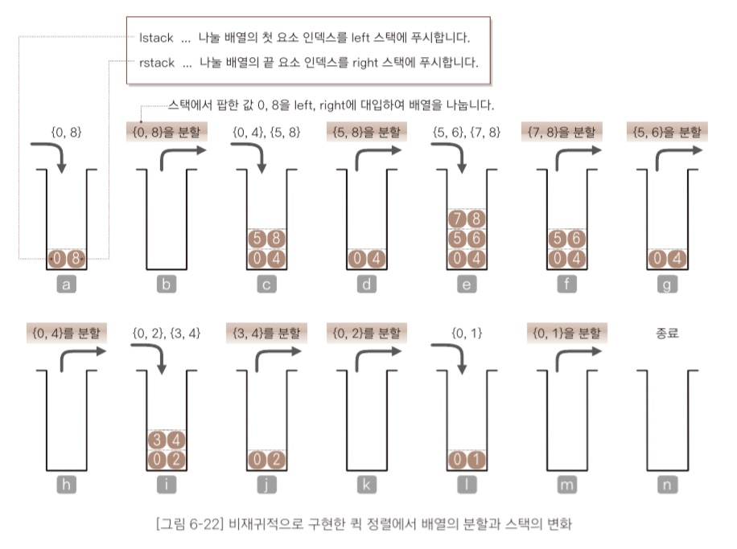

# 정렬


1. 정렬
2. 버블 정렬
3. 단순 선택 정렬
4. 단순 삽입 정렬
5. 셸 정렬
6. 퀵 정렬
---
<br />

## 06 - 1 정렬
### 정렬이란?

: 이름, 학번, 키 등 핵심 항목의 대소 관계에 따라 데이터 집합을 일정한 순서로 줄지어 늘어서도록 바꾸는 작업 (일반적으로 오름차순 / 내림차순 정렬 사용)

<br/>

### 정렬 알고리즘의 안정성
: 정렬 알고리즘은 안정된(stable) 것과 그렇지 않은 것으로 구분
> stable : 같은 값의 키를 가진 요소의 **순서가 정렬 전후에도 유지**되는 것

<br/>

### 내부 정렬과 외부 정렬
- 내부 정렬(internal sorting) : 정렬할 모든 데이터를 하나의 배열에 저장할 수 있는 경우에 사용하는 알고리즘
- 외부 정렬(external sorting) : 정렬할 데이터가 너무 많아서 하나의 배열에 저장할 수 없는 경우에 사용하는 알고리즘

<br/>

### 정렬 알고리즘의 핵심 요소
: 교환, 선택, 삽입

----

<br />

## 06 - 2 버블 정렬

### 버블 정렬
: 이웃한 두 요소의 대소 관계를 비교하며 교환을 반복하는 정렬

<br/>

1번의 패스마다 1 ~ (n-1)회의 비교를 하고 총 k-1회의 패스가 수행되어야 하므로 O(n^2).


```java
import java.util.Scanner;

class BubblesSort {
  static void swap(int[] a, int idx1, int idx2) {
    int t = a[idx1];
    a[idx1] = a[idx2];
    a[idx2] = t;
  }

  static void bubbleSort(int[] a, int n) {
    for (int i = 0; i < n; i++) 
      for (int j = n - 1; j > i; j--) 
        if (a[j - 1] > a[j])
          swap(a, j - 1, j);
  }
}
```

<br/>

### 버블 정렬 개선 1)
: 예를 들어 10개의 요소를 가진 배열을 정렬할 때, 2번의 패스만에 모든 요소가 정렬 되었으면 굳이 7번의 패스를 더 할 필요가 없다!

-> 각 패스마다 swap이 일어나는 횟수를 체크하고 패스가 끝났을 때 그 패스가 0이라면 정렬이 완료되었다는 뜻!

```java
static bubbleV2(int[] a, int n) {
  for (int i = 0; i < n-1; i++) {
    int exchg = 0;                  // swap 횟수 기록  
    for (int j = n - 1; j > i; j--)
      if (a[j - 1] > a[j]) {
        swap(a, j - 1, j);
        exchg++;                    // swap이 이루어지지 않으면 종료
      }
    if (exchg == 0) break;
  }
}
```

<br/>

### 버블 정렬 개선2)
: 1을 좀 더 확장해서, 1번째 패스가 끝나고 난 뒤 5개의 요소가 정렬 되었다면 2번째 패스라고 하더라도 6번쨰 요소까지만 비교하고 swap 하면 된다!

```java
static void bubbleV3(int[] a, int n) {
  int k = 0;                        // 첫번째 패스에서는 무조건 모든 요소를 검사해야 하므로 0으로 초기화
  while (k < n - 1) {
    int last = n - 1;
    for (int j = n - 1; j > k; j--)
      if (a[j - 1] > a[j]) {
        swap(a, j - 1, j);
        last = j;
      }
    k = last;
  }
}
```

<br/>

### 칵테일(cocktail sort) 정렬

'9 - 1 - 3 - 4 - 6 - 7 - 8'과 같은 배열이 있다고 하자.

이 배열은 2번째 요소부터 정렬이 되어 있지만 맨 앞의 9는 한번의 패스마다 한칸 밖에 뒤로 옮겨질 수밖에 없으므로 빠른 시간안에 정렬을 마칠 수 없다. 

패스의 스캔 방향을 교대로 바꾸면(홀수 번째 패스는 가장 작은 요소를 맨 앞으로, 짝수 번째 패스는 가장 큰 요소를 맨 뒤로 옮김) 이러한 정렬을 더욱 빠르게 할 수 있다.

이렇게 개선한 알고리즘을 양방향 버블 정렬(bidirection bubble sort) / 칵테일 정렬(cocktail sort) / 셰이커 정렬(shaker sort)라고 부른다.

```java
static void CockSort(int[] a, int n) {
  int left = 0;
  int right = n - 1;
  int last = right;

  while (left < right) {
      for (int j = right; j > left; j--) {
          if (a[j - 1] > a[j]) {
              swap(a, j - 1, j);
              last = j;
          }
      }
      left = last;

      for (int j = left; j < right; j++) {
          if (a[j] > a[j + 1]) {
              swap(a, j, j + 1);
              last = j;
          }
      }
      right = last;
  }
}
```
---

<br />

## 06 - 3 단순 선택 정렬

### 단순 선택 정렬(Straight selection sort)
: 배열의 정렬되지 않은 부분 중에서 **가장 작은** 요소를 선택해 알맞은 위치로 옮겨서 순서대로 정렬하는 알고리즘

<br />

- 단순 선택 정렬의 교환 과정
1. 아직 정렬하지 않은 부분에서 가장 작은 키의 값(a[min])을 선택
2. a[min]과 아직 정렬하지 않은 부분의 첫번째 요소를 교환

```java
static void selectionSort(int[] a, int n) {
  for (int i = 0; i < n - 1; i++) {
    int min = i;
    for (int k = i + 1; i < n; i++) 
      if (a[j] < a[min])
        min = j;
    swap(a, i, min);
  }
}
```

<br />

단순 선택 정렬 알고리즘의 비교는 총 (n^2 - n) / 2회 일어나며, 서로 떨어져 있는 요소를 교환하는 것이기 때문에 **안정적이지 않다(unstable sort)**.

---

<br />

## 06 - 4 단순 삽입 정렬(Straight insertion sort)

### 단순 삽입 정렬
: 선택한 요소를 정렬된 부분의 적절한 위치에 '삽입'하는 작업을 반복하여 정렬하는 알고리즘. 단순 선택 정렬과는 값이 **가장 작은 요소**를 선택하여 옮긴다는 점이 다르다.

-> 선택한 요소를 정렬된 요소들과 비교하여 적절한 위치를 찾아냄

```java
static void insertionSort(int[] a, int n) {
  for (int i = 1; i < n; i++) { // 두번째 요소부터 선택하기 때문에 i = 1로 초기화
    int j;
    int tmp = a[i];
    for (j = i; j > 0 && a[j - 1] > tmp; j--) // 교환이 일어나려면 앞의 요소가 현재 요소보다 커야하며, 동시에 현재 요소의 인덱스 값이 0보다 커야한다(j-1이 0이상이여야 하므로)
      a[j] = a[j - 1];
    a[j] = tmp;
  }
}
```
자구 수업에서는 swap으로 대체했던 것으로 기억하는데 이렇게 대입으로 처리하는게 연산 횟수 측면에서 더 효율적인 것 같다.


### 단순 정렬의 시간 복잡도
세가지 단순 정렬 (버블, 선택, 삽입)의 시간 복잡도는 모두 O(n^2)회

<br/>

### 단순 삽입 정렬 개선
: 단순 삽입 정렬은 배열의 요솟수가 많아질수록 비교, 대입 비용이 커진다. 따라서 이미 정렬된 부분에서 이진 검색으로 빠르게 요소가 삽입 될 위치를 찾아줌으로써 알고리즘을 개선할 수 있다.
<br />

```java
static void binInsertionSort(int[] arr, int n) {
  for (int i = 1; i < n - 1; i++) {
      int temp = arr[i];

      int start = 0;
      int mid = 0;
      int end = i - 1;
      int pos;

      while (start <= end) {
          mid = (start + end) / 2;
          if (arr[mid] > temp) start = mid + 1;
          else if (arr[mid] < temp) end = mid - 1;
          else break;
      }
      pos = (start <= end) ? mid + 1 : end + 1;

      for (int j = i; j > pos; j--)
          arr[j] = arr[j-1];
      arr[pos] = temp;
  }
```

---

<br/>

## 06 - 5 셸 정렬(Shell sort)

<br/>

### 단순 삽입 정렬의 특징
'1 - 2 - 3 - 4 - 5 - 0 - 6'과 같은 배열이 있다고 하자.

5번째 요소까지는 정렬이 되어있기 때문에 비교 연산만 있고 swap은 없기 때문에 빠르게 정렬이 된다. 그러나 0을 삽입하려면 많은 수의 swap이 발생한다.

이러한 단순 삽입 정렬의 특징을 정리해보면,

1. 정렬을 마쳤거나 정렬을 마친 상태에 가까우면 정렬 속도가 매우 빨라진다.
2. 삽입할 위치가 멀리 떨어져 있으면 이동(대입)해야 하는 횟수가 많아진다.

<br/>

### 셸 정렬
: 단순 삽입 정렬의 장점은 살리고 단점은 보완한 정렬 알고리즘. 배열을 여러 그룹으로 나누어 각각 단순 삽입 정렬으로 정렬한 후 그 그룹을 합치며 정렬을 반복한다. (퀵 정렬이 고안되기 전까지는 가장 빠른 알고리즘으로 알려져 있었다고 한다..)


셸 정렬에서는 일정한 간격을 가진 요소를 한 그룹으로 간주한다. 예를 들어서 배열 요소가 12개이고 처음 설정한 간격이 4라면 총 4개의 그룹이 생기게 되는데, 각 그룹에 포함되는 요소의 인덱스는 다음과 같다.

1. (0, 4, 8)
2. (1, 5, 9)
3. (2, 6, 10)
4. (3, 7, 11)

각 그룹 별로 삽입 정렬이 완료 되면 그 다음으로 그룹들을 합쳐 새로운 그룹을 만드는데, **처음 설정했던 간격을 줄여주면** 새로운 그룹을 만든 것과 같은 결과가 나온다. 방금의 예시에서 간격을 2로 줄이면 두 개의 그룹이 생기게 되는데, 

1. (0, 2, 4, 6 , 8, 10)
2. (1, 3, 5, 7, 9, 11)

처음의 1, 3번 그룹이 하나로 합쳐지고 2, 4번 그룹이 하나로 합쳐진 것을 확인 할 수 있다. 합치기 전 각 그룹이 정렬된 상태였기 때문에 합친 후의 그룹은 **정렬에 가까운 상태**가 된다. 즉, 삽입 정렬의 장점이 극대화된다. 
<a href="https://gmlwjd9405.github.io/2018/05/08/algorithm-shell-sort.html">그림과 함께 자세한 설명을 보고 싶다면 여기로</a>

```java
static void shellSort(int[] a, int n) {
  for (int h = n / 2; h > 0; h /= 2)
    for (int i = h; i < n; i++) {
      int j;
      int tmp = a[i];
      for (j = i - h; j >= 0 && a[j] > tmp; j -= h) // h만큼 떨어진 요소들(즉, 한 그룹으로 묶인 요소들)을 정렬하는 과정
        a[j + h] = a[j];
      a[j + h] = tmp;
    }
}
```
위 코드에서 h는 간격을 의미한다. 처음 n/2로 초기화 되므로 n/2개의 그룹으로 시작하며 반복될 때마다 그룹이 두 개씩 합쳐져 (이전의 그룹 수) / 2의 그룹이 생긴다. 이 과정을 반복하다 최종 1개의 그룹만 남게 되면 정렬이 완료된다.

<br/>

### 증분값(h 값)의 선택


여기서 a는 학생 8명의 점수를 나타내고 있다고 가정한다. b처럼 학생을 2명씩 4개의 그룹으로 나누어 정렬하고 c처럼 학생을 4명씩 2개의 그룹으로 나누어 다시 정렬한다. 여기서 b의 2개의 그룹을 각각 합치면 c의 그룹이 된다. 즉 '갈색 그룹'과 '회색 그룹'은 서로 섞이지 않는다. 이렇게 그룹이 섞이지 않은 상태에서 두 그룹을 합치면 다시 처음 단계인 a와 동일한 상태가 된다( *동일한 상태라는 말은 그룹의 구성 요소가 같다는 뜻이다???* ). 그럼 다시 a의 학생을 정렬하는 것과 같아서 정렬 알고리즘이 동작하지 않는다.


이런 문제를 해결하기 위해서는 h 값이 서로 배수가 되지 않도록 해야한다. (그럼 요소가 충분히 섞인다.) 다음의 수열을 활용할 수 있다
**h = ..., 121, 40, 13, 4, 1** 이 수열은 1부터 시작해서 3배한 값에 1을 더하는 수열이다. 또한 h의 초깃값이 너무 크면 효과가 없기 때문에 n을 9로 나눈 값을 넘지 않도록 정해야 한다고 한다.

```java
static void shellSort2(int[] a, int n) {
  int h;
  for (h = 1; h < n / 9; h = h * 3 + 1>); // h의 초깃값 설정

  for ( ; h > 0; h /= 3) // h /= 3은 1을 빼고 3으로 나눈 값과 같음
    for (int i = h; i < n; i++) {
      int j;
      int tmp = a[i];
      for (j = i - h; j >= 0 && a[j] > tmp; j -= h)
        a[j + h] = a[j];
      a[j + h] = tmp;
    }
}
```
---

<br/>

## 06 - 6 퀵정렬

### 퀵정렬 살펴보기
: 퀵 정렬은 가장 빠른 정렬 알고리즘 중의 하나이다. 배열에서 하나의 **피벗(pivot)** 값을 설정하여 왼쪽은 피벗 값보다 작은 요소이, 오른쪽은 큰 값을 가진 요소들이 위치하게 만든 후 각각을 새로운 그룹으로 간주하고 같은 과정을 반복한다(*이 때 피벗값과 같은 요소는 왼쪽에 있든, 오른쪽에 있든 상관없다.*)

<br/>

### 배열을 두 그룹으로 나누기
: 그렇다면 어떻게 피벗 왼쪽에는 작은 값을 가진 요소를, 오른쪽에는 큰 값을 가지 요소를 배치할 수 있을까? 이는 다음과 같은 과정을 거치면 된다.

1. 피벗 값을 x라고 한다. 그룹의 왼쪽 끝 요소의 인덱스 pl을 왼쪽 커서, 오른쪽 끝 요소의 인덱스 pr을 오른쪽 커서라고 가정한다.
2. a[pl] >= x가 성립하는 요소를 찾을 때까지 pl을 오른쪽으로 스캔한다.(즉, 왼쪽에 있는 첫번째 큰 값을 찾아준다)
3. a[pr] <= x가 성립하는 요소를 찾을 때까지 pr을 왼쪽으로 스캔한다. (즉, 오른쪽에 있는 작은 값을 찾아준다)
4. 두 값을 바꿔준다.
5. 만약 pl > pr이 된다면 더이상 바꿀 값이 있지 않다는 말이므로 해당 그룹에서의 분류를 끝내고 왼쪽 오른쪽 각각 작은 그룹에서 위 과정을 반복한다.


<br/>

```java
static void swap(int[] a, int idx1, int idx2) {
  int t = a[idx1]; a[idx1] = a[idx2]; a[idx2] = t;
}

static void quickSort(int[] a, int left, int right) {
  int pl = left;
  int pr = right;
  int x = a[(pl +pr) / 2];

  do {
    while (a[pl] < x) pl++; // 왼쪽에서 피벗보다 큰 값을 찾을 때까지
    while (a[pr] > x) pr--; // 오른쪽에서 피벗보다 작은 값을 찾을 때 까지
    if (pl <= pr)
      swap(a, pl++, pr--);
  } while(pl <= pr); // pl과 pr이 교차하면 분류 완료

  if (left < pr) quickSort(a, left, pr); // 분류 완료 되었을 때 pr의 값이 left(왼쪽 끝 요소의 인덱스) 크다면 그 그룹의 요소가 2개 이상이라는 말이므로 정렬이 필요.
  if (pl < right) quickSort(a, pl, right); // 위와 마찬가지
}

public static void main(String[] args) {
  quickSort(x, 0, n - 1);
}
```


<br/>

### 비재귀적인 퀵 정렬
: 스택을 활용하여 비재귀적인 방식으로도 퀵 정렬 구현이 가능하다.

```java
static void quickSort2(int[] a, int left, int right) {
  Stack lstack = new Stack();
  Stack rstack = new Stack();

  lstack.push(left); // 반복문 들어가기 전 처음에 넣어줘야 함
  rstack.push(right);

  while (lstack.isEmpty() != true) {
    int pl = left = lstack.pop();
    int pr = right = rstack.pop();
    int x = a[(left + right) / 2];

    do {
      while (a[pl] < x) pl++;
      while (a[pr] > x) pr--;
      if (pl <= pr)
        swap(a, pl++, pr--);
    } while (pl <= pr);

    if (left < pr) { 
      lstack.push(left);
      rstack.push(pr);
      // left, pr 값을 스택에 넣었다가 뽑아서 작은 그룹을 재정렬
    }
    if (pl < right) {
      lstack.push(pl);
      rstack.push(right);
    }
  }
}
```



<br/>

### 스택의 용량
: 위의 코드에서는 왼쪽 하위 그룹의 pl, pr 값을 먼저 스택에 넣었다.  그러면 LIFO에 따라 오른쪽 그룹이 먼저 분류 과정을 거치게 된다. 

그런데 이 때, 요솟수가 더 작은 그룹을 먼저 분류하면 스택의 용량을 아낄 수 있게 된다. 


<br/>


<br/>

### 피벗 선택하기
: 피벗을 선택하는 방법은 퀵 정렬의 실행 효율에 큰 영향을 주기 때문에 매우 중요하다. 피벗이 항상 중간값을 가리키면 시간 복잡도는 nlogn이다. 하지만 만약 피벗이 계속 배열을 1, n-2개의 그룹으로 나눈다면 시간 복잡도는 n^2이된다. 무작위로 섞여 있는 배열에서 어떻게 하면 중간값에 가까운 피벗을 고를 수 있을까?

책에서 제시한 첫번째 방법은 다음과 같다.
1. 나눌 배열의 요소 개수가 3 이상이면 임의로 3개의 요소를 선택하고 그중에서 중앙값인 요소를 피벗으로 선택한다. <br/> : 이렇게 짜는 방법이 최선은 아니지만 최악(1, n-2개로 나뉘는 경우)은 피할 수 있다.
2. 나눌 배열의 처음, 가운데, 끝 요소를 정렬한 뒤 **중앙값(가운데 인덱스가 아님!)**과 끝에서 두번째 요소를 교환한다. 그 후 끝에서 두번째 요소의 값을 피벗으로 정한다. 이렇게 되면 첫번째요소와 마지막 요소는 피벗값과의 관계가 확실하기 때문에(정렬했으므로) 나눌 때 스캔할 요소를 3개씩 줄일 수 있게 된다. 